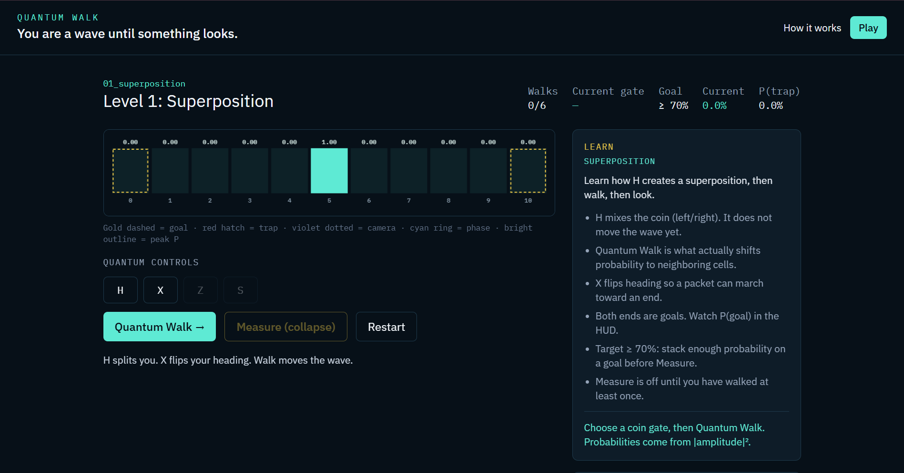
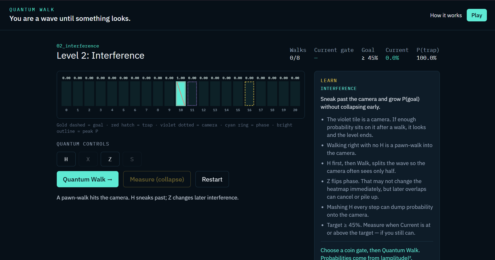
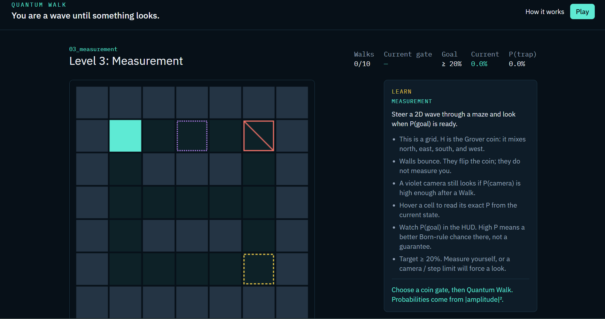
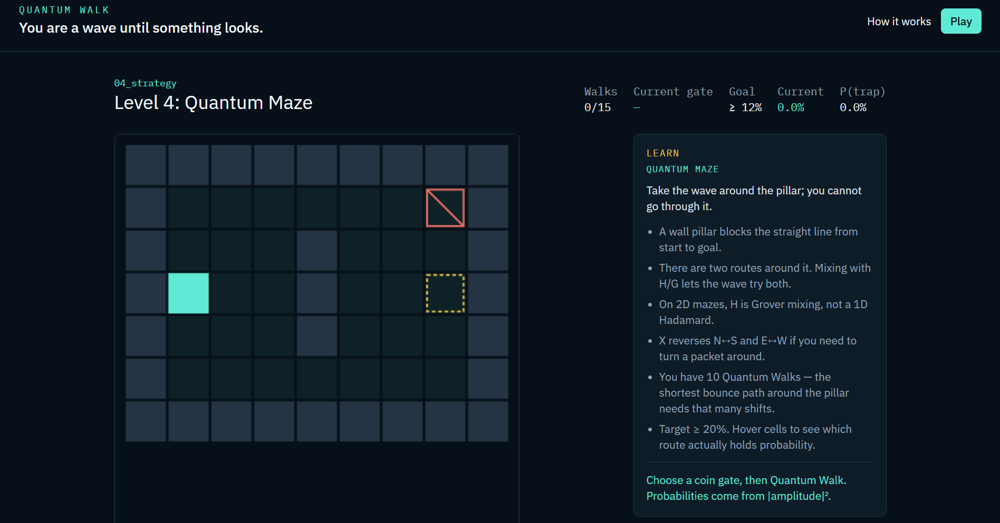
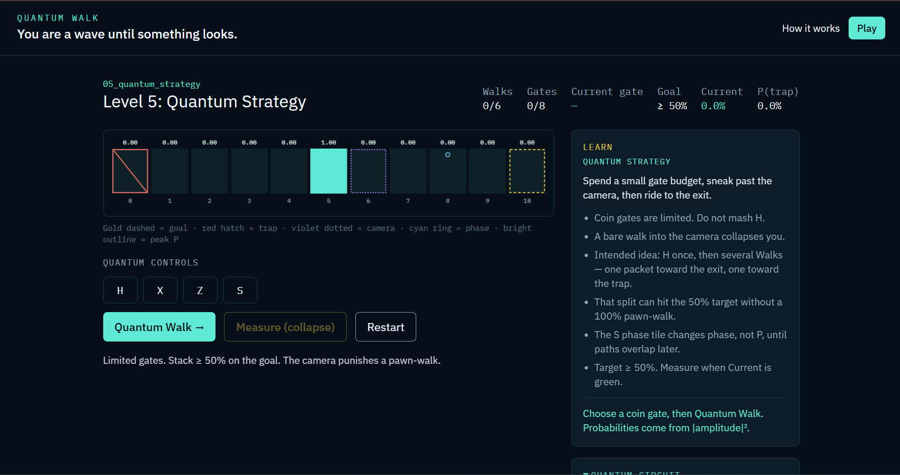

# Quantum Walk Game

> **A playable quantum-walk puzzle where you control the wave, not the pawn.**

[](https://www.python.org/)
[](https://react.dev/)
[](https://fastapi.tiangolo.com/)
[](https://numpy.org/)
[](https://www.ibm.com/quantum/qiskit)

<!-- Add the deployed URL here after deployment -->
<!-- [**Play the game →**](https://your-live-url.example) -->

## What is Quantum Walk Game?

**Quantum Walk Game** is an educational puzzle/maze built around a real **discrete-time quantum walk (DTQW)**.

Instead of moving a classical pawn from one square to another, the player controls a **quantum state represented by complex amplitudes**. Gates change the coin/direction state, Quantum Walk propagates the wave through the map, and interference changes where probability accumulates.

The goal is to make concepts such as **superposition, interference, phase, measurement, and quantum probability** something you can actually play with.

### Live Demo

**Play Quantum Walk Game →**[https://qhop-quantus.vercel.app](https://qhop-quantus.vercel.app)

### The core idea

```text
Choose a coin operation
        ↓
Apply H / X / Z / S
        ↓
Quantum Walk → propagate the wave
        ↓
Watch P(goal), P(trap), and the heatmap
        ↓
Choose when to Measure
        ↓
The wave collapses to one cell
```

The game does **not** fake the probability cloud with random animations. Gameplay is driven by the NumPy quantum simulation.

---

## Features

- Real complex-amplitude quantum-walk simulation
- 1D Hadamard walk for the tutorial levels
- 2D Grover walk for maze levels
- Reflecting walls and map boundaries
- Player-controlled **H, X, Z, S** coin operations
- Separate **Quantum Walk** shift action
- Born-rule measurement and state collapse
- Goal and trap probabilities shown live
- Observation/camera tiles that can force measurement
- Phase tiles for interference-based puzzles
- Interactive probability heatmap
- Level-specific educational **LEARN** panels
- Qiskit circuit view for 1D gameplay
- Qiskit Aer vs NumPy validation tests
- Win, loss, retry, next-level, and campaign-complete UX
- Five-level linear campaign
- Accessibility-aware reduced-motion animations

---

# How to Play

You are controlling a **quantum wave**, not a classical pawn.

### 1. Choose a gate

Use the available quantum controls:

| Gate | Role |
|---|---|
| **H** | Mixes coin/direction states. Hadamard in 1D; Grover mixing in 2D. |
| **X** | Flips direction/heading. |
| **Z** | Changes phase. |
| **S** | Applies phase rotation. |
| **Quantum Walk →** | Propagates the current state through the map. |
| **Measure (collapse)** | Samples a cell using the Born rule and ends the level. |

A gate changes the **coin state**; it does not itself move the wave.

### 2. Walk the wave

**Quantum Walk** performs the reflecting shift. The probability distribution then changes according to the current amplitudes.

### 3. Watch the probability

The HUD shows:

- `P(goal)`
- `P(trap)`
- current gate
- number of walks
- target probability
- measurement/status information

On 2D levels, hover over a cell to inspect its exact probability.

### 4. Measure

Measurement samples a position from the current distribution:

\[
P(p)=\sum_c |\alpha_{p,c}|^2
\]

The state then collapses to the measured cell.

**High probability is not a guarantee** — it is a higher chance of being measured there. The skill objective is to build enough probability on the goal before measuring.

---

# The Quantum Mechanics Behind It

The game stores **amplitudes**, not probabilities, as its evolving state:

\[
|\psi\rangle =
\sum_{p,c}\alpha_{p,c}|p\rangle\otimes|c\rangle
\]

A complete textbook walk step is:

\[
U = SC
\]

where:

- \(C\) is the coin operation
- \(S\) is the conditional shift
- \(\alpha\) values are complex amplitudes
- \(P(p)=\sum_c|\alpha_{p,c}|^2\)

### Superposition

A coin operation can distribute amplitude across multiple directions/positions.

### Interference

When paths meet, their **complex amplitudes add**. They can reinforce one another or cancel:

- constructive interference → more probability
- destructive interference → less probability

This is why a gate can appear to do little immediately but have a large effect several walks later.

### Measurement

Before measurement, the game displays a probability distribution rather than a definite classical position. Measurement samples from that distribution and collapses the state to one cell.

---

# Walls, Cameras, Goals & Phase Tiles

These objects are intentionally different.

| Object | Behaviour |
|---|---|
| **Floor** | Holds amplitude and contributes to the probability distribution. |
| **Wall / boundary** | Reflects the wave; does **not** measure it. |
| **Goal** | Wins when measurement collapses onto a goal cell. |
| **Trap** | Losing outcome when measurement collapses onto a trap. |
| **Camera / observation tile** | Can force a measurement when its probability reaches the level threshold. |
| **Phase tile** | Changes phase only; it does not collapse the state. |

> **Important:** Walls shape unitary evolution. Traps and goals are evaluated after a look. Cameras can force that look. Phase tiles change phase without measuring.

---

# The Five-Level Campaign

The campaign progresses from basic quantum behaviour to strategy.

## Level 1 — Superposition

**`01_superposition`**

Learn the basic rhythm:

**choose a gate → Quantum Walk → observe the distribution → Measure**

The 1D line demonstrates Hadamard mixing and directional control with X. Both ends of the line are goals.



---

## Level 2 — Interference

**`02_interference`**

Now the challenge is not simply reaching a position — it is controlling **interference**.

A camera sits on the naive route. The player learns that phase and mixing can change what happens when probability paths overlap.



---

## Level 3 — Measurement

**`03_measurement`**

The first 2D maze.

Navigate a grid containing walls, a goal, a trap, and an observation/camera tile. Walls reflect the wave, while cameras can force a measurement.

The key lesson:

> **Walls bounce. Cameras look. Measure when P(goal) is high.**



---

## Level 4 — Quantum Maze

**`04_strategy`**

A pillar blocks the direct route to the goal.

The wave must explore around the obstacle, using **2D Grover mixing** and directional operations to influence the available routes.



---

## Level 5 — Quantum Strategy

**`05_quantum_strategy`**

The final level adds tighter resource constraints.

Gate usage is limited, a camera punishes a naive pawn-like walk, and a phase tile introduces another opportunity for interference.

The intended challenge is to make a small number of carefully chosen operations do the work of many random moves.



---

# Architecture

The project is deliberately split into three main layers:

```text
┌───────────────────────────────┐
│        React Frontend         │
│  UI • Canvas • Controls • UX  │
└───────────────┬───────────────┘
                │ HTTP / JSON
                ▼
┌───────────────────────────────┐
│         FastAPI Backend       │
│ Rules • Levels • Sessions     │
│ Win/Loss • Measurement logic  │
└───────────────┬───────────────┘
                │
                ▼
┌───────────────────────────────┐
│       Quantum Engine          │
│ NumPy amplitudes • Coin •     │
│ Shift • Measurement • State   │
└───────────────┬───────────────┘
                │
                └──────► Qiskit + Aer
                         circuit + validation
```

### Why NumPy and Qiskit?

**NumPy is the gameplay engine.**

Every gameplay move uses the custom NumPy implementation because the game needs:

- custom maze geometry
- reflecting walls
- fast state updates
- probability heatmaps
- phase tiles
- flexible level rules

**Qiskit + Aer is the circuit/validation layer.**

Qiskit is used for the **1D circuit view** and for checking that the circuit/statevector agrees with the NumPy implementation.

Gameplay does **not** depend on IBM Quantum hardware.

> **NumPy runs the game. Qiskit helps prove and explain the game.**

---

# Project Structure

```text
quantum-walk-game/
│
├── README.md
│
├── quantum_engine/
│   ├── __init__.py
│   ├── state.py
│   ├── coin.py
│   ├── shift.py
│   ├── walk.py
│   ├── measurement.py
│   ├── qiskit_circuit.py
│   ├── validation.py
│   └── errors.py
│
├── backend/
│   ├── main.py
│   ├── models.py
│   ├── game.py
│   └── levels.py
│
├── levels/
│   ├── 01_superposition.json
│   ├── 02_interference.json
│   ├── 03_measurement.json
│   ├── 04_strategy.json
│   └── 05_quantum_strategy.json
│
├── frontend/
│   ├── src/
│   │   ├── App.tsx
│   │   ├── ResultOverlay.tsx
│   │   ├── Board1D.tsx
│   │   ├── Board2D.tsx
│   │   ├── EducationPanel.tsx
│   │   ├── CircuitSidebar.tsx
│   │   └── gameApi.ts
│   ├── package.json
│   ├── vite.config.ts
│   └── ...
│
├── tests/
│   ├── test_walk_1d.py
│   ├── test_walk_2d.py
│   ├── test_interference.py
│   ├── test_measurement.py
│   ├── test_qiskit_agreement.py
│   ├── test_player_ops.py
│   ├── test_api.py
│   └── test_campaign.py
│
└── requirements.txt
```

---

# Core Simulation

## 1D

The state is stored as:

```text
(N, 2)
```

with coin states:

```text
|R⟩ = |0⟩
|L⟩ = |1⟩
```

The 1D coin is the Hadamard operator:

\[
H=\frac{1}{\sqrt2}
\begin{pmatrix}
1&1\\
1&-1
\end{pmatrix}
\]

## 2D

The state is stored as:

```text
(H, W, 4)
```

with coin directions:

```text
N, E, S, W
```

The 2D H button uses the Grover coin:

\[
G=2|s\rangle\langle s|-I
\]

where

\[
|s\rangle=\frac12
\left(|N\rangle+|E\rangle+|S\rangle+|W\rangle\right)
\]

The coordinate convention is:

```text
origin = top-left
+x     = right
+y     = down
North  = y - 1
East   = x + 1
South  = y + 1
West   = x - 1
```

---

# Frontend

The frontend is built with:

- React
- TypeScript
- Vite
- Tailwind CSS
- HTML Canvas
- Framer Motion for selected UI animations

The board visualizes probability as brightness:

- brighter cell → more probability
- cyan outline → current probability peak
- gold dashed → goal
- red hatched → trap
- violet dotted → camera/observation
- cyan ring → phase tile

The UI also provides short explanations after actions so the player can connect what they clicked to what happened physically.

---

# API

The FastAPI backend exposes the core game loop:

| Method | Endpoint | Purpose |
|---|---|---|
| `GET` | `/health` | Health check |
| `GET` | `/levels` | Campaign level list |
| `GET` | `/levels/{id}` | Full level definition |
| `POST` | `/game/start` | Start a fresh session |
| `POST` | `/game/move` | Apply a gate or Quantum Walk |
| `POST` | `/game/measure` | Measure/collapse the state |
| `GET` | `/game/state` | Read current game state |
| `GET` | `/game/circuit` | Get the 1D Qiskit circuit payload |

The backend keeps sessions in memory for v1. Restarting the API therefore resets active games.

---

# Testing & Validation

The project uses **pytest** to validate both the physics and the game rules.

The test suite covers:

- unitary coin operations
- normalization
- ballistic 1D quantum-walk behaviour
- constructive/destructive interference
- Born-rule measurement
- seeded measurement replay
- 2D Grover mixing
- wall reflection
- player gate operations
- API legality and state transitions
- camera threshold behaviour
- campaign ordering
- Qiskit Aer vs NumPy agreement

The current build-bible records **54 passing tests** after the win/campaign UX work.

---

# Run Locally

## Requirements

- Python 3.11+
- Node.js 20+
- npm

## Backend

From the repository root:

```bash
python -m venv .venv
```

### Windows

```powershell
.venv\Scripts\activate
```

### Install dependencies

```bash
pip install -r requirements.txt
```

### Run tests

```bash
pytest
```

### Start FastAPI

```bash
uvicorn backend.main:app --reload --port 8000
```

## Frontend

Open another terminal:

```bash
cd frontend
npm install
npm run dev
```

Then open:

```text
http://localhost:5173
```

The Vite development server proxies:

```text
/levels
/game
/health
```

to the FastAPI backend on port `8000`.

---

# Deployment

Deployment is the next production step.

The intended v1 arrangement is:

```text
Frontend → Vercel / Netlify
Backend  → Render / Railway
```

The frontend should point to the deployed API through:

```text
VITE_API_URL
```

and the backend must allow the production frontend origin through CORS.

---

# What the Player Should Learn

By the end of the campaign, the player should understand that:

1. A quantum walk is not a classical pawn moving one square at a time.
2. The evolving state is made of **complex amplitudes**.
3. Probabilities come from the squared magnitudes of those amplitudes.
4. Multiple paths can interfere constructively or destructively.
5. Gates can change the future probability distribution without immediately moving the wave.
6. Measurement is fundamentally different from simply watching the probability heatmap.
7. A high `P(goal)` increases the chance of a successful measurement but does not guarantee it.
8. The player can deliberately shape the distribution instead of relying on random movement.

---

# What This Project Is Not

This v1 intentionally does **not** include:

- IBM Quantum/QPU execution
- multiplayer
- accounts/authentication
- payments
- a database
- 3D rendering
- Three.js
- browser/WASM quantum simulation
- a level editor
- classical WASD pawn movement

The goal is a focused, explainable quantum-walk experience rather than a large game engine.

---

# Design Philosophy

The central design rule is:

> **Skill comes from choosing operations that causally change the quantum state — not from adding more randomness.**

That is why the game separates:

```text
COIN OPERATION ≠ QUANTUM WALK
```

The player decides **how to change the state**, then decides **when to propagate it**, and finally decides **when to measure**.

The result is a puzzle where the interesting question is not:

> “Where will the pawn go?”

but:

> **“What should I do to the wave now so that interference puts probability where I want it later?”**

---

# Future Ideas

Possible post-v1 additions include:

- classical vs quantum comparison visualizations
- probability-over-time graphs
- phase visualization
- sound design
- undo
- mobile layout improvements
- level editor
- richer 2D circuit visualization
- optional IBM Quantum/QPU integration
- persistent scores

These are intentionally outside the focused v1 experience.

---

## Built With

**Python · NumPy · Qiskit · Qiskit Aer · pytest · FastAPI · Pydantic · Uvicorn · React · TypeScript · Vite · Tailwind CSS · HTML Canvas · Framer Motion**

---

## Project Status

**v1 gameplay:** Complete  
**Five-level campaign:** Complete  
**Quantum simulation:** Complete  
**Qiskit validation/circuit view:** Complete  
**Win/loss/campaign UX:** Complete  
**Deployment:** Next

---

> **Quantum Walk Game**  
> *Control the wave. Shape the probability. Take the measurement.*
